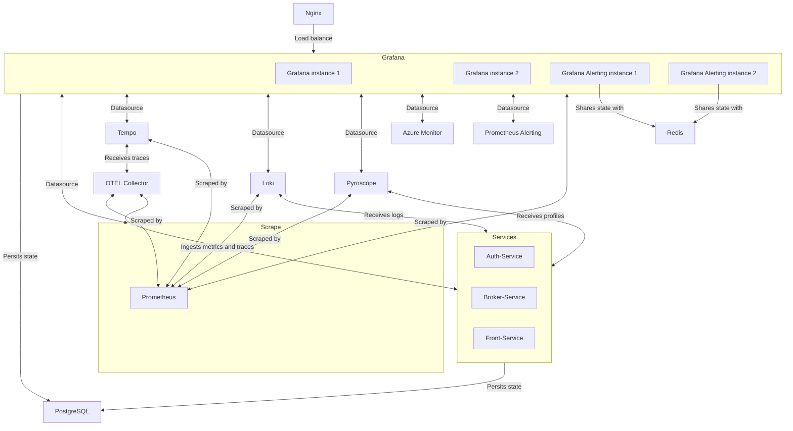

# Grafana Observability stack in HA

Documentation: https://grafana.com/docs/grafana/latest/alerting/set-up/configure-high-availability/

### Service Relations in Docker Compose

The following diagram illustrates the relationships between the services deployed in the `docker-compose.yaml` file:



## Run Grafana in HA

Highlights:

- Two instances of Grafana.
- User a ngix to balance traffic.
- Use PostgreSQL to store data.
- Use Redis to balance Grafana Alerting scheduler.

## OTEL collector for ingest metrics and traces

## Send logs to Loki

## Correlate traces with logs and metrics

## Send profiles to Pyroscope

## Grafana alerting

### How Grafana Alerting Load Balancing Works Using Redis in High Availability Contexts

The load balancing of Grafana Alerting using Redis in high availability contexts relies on Redis's ability to handle large volumes of real-time data and distribute the load across multiple nodes. Here's how it works:

- **Data Storage**: Redis is used to store time series data, allowing Grafana to quickly access the necessary data to generate alerts.

- **Load Distribution**: In a high availability environment, Redis can distribute the workload across several nodes. This ensures that if one node fails, other nodes can take over without service interruptions.

- **Alert Configuration**: Grafana can configure alerts based on the data stored in Redis. These alerts can be customized to monitor different metrics and send notifications when anomalies are detected.

- **Scalability**: Redis allows horizontal scaling, meaning you can add more nodes to handle larger volumes of data and more alert queries without affecting performance.

- **Integration**: Grafana integrates with Redis through specific plugins and configurations that enable data visualization and alert configuration directly from the Grafana interface.

#### Reference links

- https://www.jorgedelacruz.es/2022/10/19/grafana-vistazo-profundo-a-grafana-alerting-recibiendo-alertas-sobre-paneles-consultas-etc/


## Grafana - Prometheus alerting integration


## Reference repos

- https://github.com/grafana/alerting-ha-docker-examples/tree/main
- https://github.com/grafana/demo-prometheus-and-grafana-alerts
- https://github.com/grafana/provisioning-alerting-examples
- https://github.com/VahagnMian/golang-microservices-observability

### 🛠 Pre-requisites

Before diving in, ensure you have the following:

1. **`psql`**: Not installed? 🛑 Installation both for Mac and Ubuntu Follow the guide [here](https://www.timescale.com/blog/how-to-install-psql-on-mac-ubuntu-debian-windows/).

2.  Execute the following commands to set up your database:
```bash
docker-compose up -d postgres
psql -h localhost -p 5432 -U postgres -c "CREATE DATABASE users;"
psql -h localhost -p 5432 -U postgres -d users -a -f ./config/resources/users.sql
```
